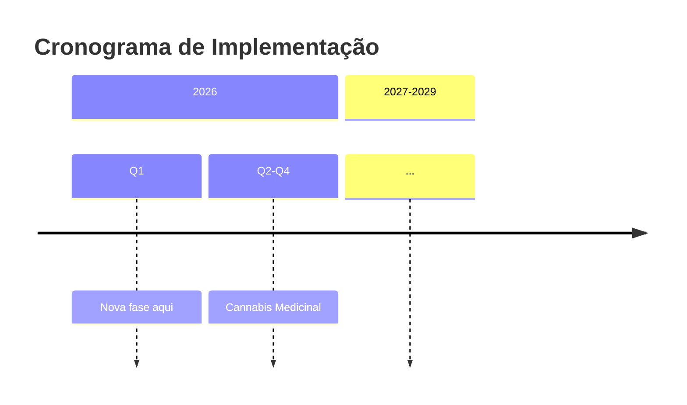
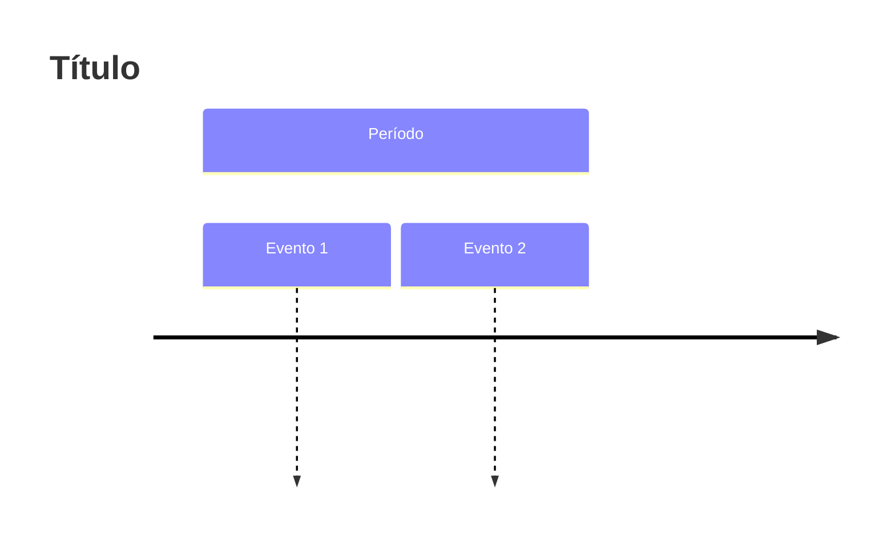
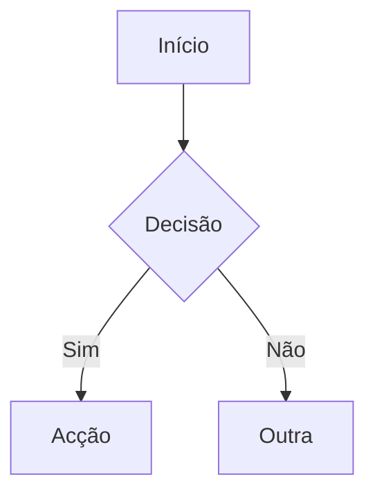
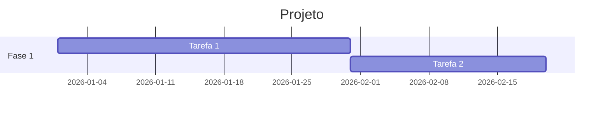
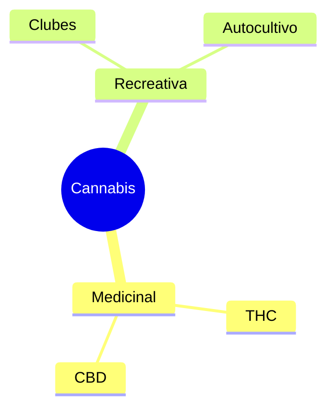

# Diagramas - Proposta Cannabis

Diagramas Mermaid criados para visualizar a estrutura da proposta.

## Ficheiros Disponíveis

### 1. Cronograma de Implementação
**Ficheiro:** `cronograma-implementacao.mmd` / `cronograma-implementacao.png`

Timeline mostrando fases de implementação 2026-2030+.

**Como usar no documento:**
```markdown
# CAPÍTULO 8: CRONOGRAMA

A implementação será faseada ao longo de 4 anos:


```

---

### 2. Estrutura da Proposta em 3 Partes
**Ficheiro:** `estrutura-proposta.mmd` / `estrutura-proposta.png`

Flowchart mostrando as 3 partes independentes (Medicinal, Recreativa, Cânhamo) e suas relações.

**Como usar no documento:**
```markdown
# SECÇÃO II: PROPOSTA EM 3 PARTES

A proposta está organizada em 3 partes independentes mas complementares:


## PARTE I: Cannabis Medicinal
**Prioridade: 2026 | Status: Urgente**
...
```

---

### 3. Modelo Alemão (Pillar 1 e 2)
**Ficheiro:** `modelo-alemao-pillars.mmd` / `modelo-alemao-pillars.png`

Diagrama explicando o modelo alemão de 2 pilares e recomendação para Portugal.

**Como usar no documento:**
```markdown
### 3.1.5 Abordagem Faseada: Modelo Alemão

A Alemanha adoptou uma abordagem em dois pilares, implementando apenas
o primeiro inicialmente:


**Pillar 1 (Implementado desde abril 2024):**
- Autocultivo (até 3 plantas)
- Clubes sem fins lucrativos (máx. 500 membros)

**Pillar 2 (Adiado):**
- Venda comercial em cidades-piloto
- Avaliação rigorosa antes de implementação nacional

**Recomendação para Portugal:** Adoptar apenas Pillar 1 inicialmente,
com avaliação obrigatória após 3 anos antes de decidir sobre Pillar 2.
```

---

### 4. Receitas Fiscais (Modestas vs Comercial)
**Ficheiro:** `receitas-fiscais.mmd` / `receitas-fiscais.png`

Comparação entre modelo comercial (Canadá) e modelo de clubes (Portugal),
clarificando que receitas são modestas.

**Como usar no documento:**
```markdown
## 2.4 Análise Custo-Benefício

### 2.4.3 Receitas Fiscais: Expectativas Realistas

É crucial clarificar que o modelo de clubes sem fins lucrativos
gera receitas fiscais **modestas**, não comparáveis ao modelo
comercial canadiano:


**Portugal (modelo de clubes):** €2-5 milhões/ano
- Taxas licenciamento clubes
- IVA sementes/equipamento
- Taxas agência reguladora

**Canadá (modelo comercial):** CAD $5.4 mil milhões/ano
- Dispensários privados
- Mercado massivo

⚠️ **O benefício principal do modelo português é a REDUÇÃO de custos
(sistema judicial, saúde pública), não a arrecadação de receitas.**
```

---

## Editar Diagramas

Para modificar um diagrama:

1. Edita o ficheiro `.mmd` correspondente
2. Regenera a imagem:
   ```bash
   mmdc -i arquivo.mmd -o arquivo.png -b transparent -w 1200 -H 800
   ```
3. A imagem atualiza automaticamente no documento

### Exemplo: Adicionar fase ao cronograma

Edita `cronograma-implementacao.mmd`:


Regenera:
```bash
mmdc -i cronograma-implementacao.mmd -o cronograma-implementacao.png -b transparent -w 1200 -H 800
```

---

## Incluir no Build

Os diagramas são incluídos automaticamente no DOCX via Pandoc:

```bash
bash scripts/build.sh
```

O script usa `--resource-path=".:assets/diagrams"` para encontrar as imagens.

---

## Cores Usadas

- **Vermelho** (`#ff6b6b`): Urgente / Crítico
- **Azul** (`#4dabf7`): Médio prazo / Recomendação
- **Verde** (`#51cf66`): Paralelo / Implementado
- **Amarelo** (`#ffd43b`): Aviso / Adiado

---

## Tipos de Diagrama Disponíveis

Mermaid suporta vários tipos:

### Timeline (Cronograma)


### Flowchart (Fluxograma)


### Gantt (Diagrama de Gantt)


### Mindmap (Mapa Mental)


Mais exemplos: https://mermaid.js.org/
