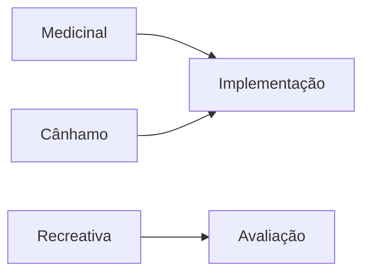
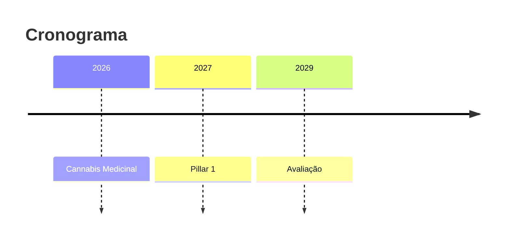

# Sistema de Build - Documento Cannabis

Sistema automatizado para conversão de Markdown → DOCX com:
- ✅ **Índice automático** (gerado pelo Pandoc)
- ✅ **Referências dinâmicas** (BibTeX + CSL)
- ✅ **Numeração automática** de secções
- ✅ **Suporte para diagramas** Mermaid

## Instalação

```bash
# 1. Instalar dependências (Pandoc, Mermaid CLI, etc.)
chmod +x build/setup.sh
./build/setup.sh
```

## Migração de Referências

Converte referências hardcoded `[1]`, `[2]` → BibTeX automático:

```bash
# Gera build/references.bib a partir do documento atual
python3 build/migrate-references.py
```

### Uso de Citações no Markdown

Depois de migrar, substitui:

**ANTES (hardcoded):**
```markdown
A cannabis medicinal em Portugal[^1] tem crescido exponencialmente[^2].

[^1]: [[1] Infarmed (2024)...](#ref)
[^2]: [[2] Euronews (2024)...](#ref)
```

**DEPOIS (dinâmico):**
```markdown
A cannabis medicinal em Portugal [@infarmed2024] tem crescido
exponencialmente [@euronews2024].
```

Pandoc gera automaticamente a bibliografia no fim do documento.

### Sintaxe de Citações

| Formato | Markdown | Resultado |
|---------|----------|-----------|
| Normal | `[@infarmed2024]` | (Infarmed, 2024) |
| Múltiplas | `[@infarmed2024; @eco2024]` | (Infarmed, 2024; ECO, 2024) |
| No texto | `@infarmed2024 afirma que...` | Infarmed (2024) afirma que... |
| Sem autor | `[-@infarmed2024]` | (2024) |
| Com página | `[@infarmed2024, p. 15]` | (Infarmed, 2024, p. 15) |

## Índice Automático

O Pandoc gera o índice automaticamente com `--toc`:

```markdown
# SECÇÃO I: CONTEXTO
## CAPÍTULO 1: Introdução
### 1.1 Subcapítulo

# SECÇÃO II: PROPOSTA
## PARTE I: Cannabis Medicinal
```

**Não precisas** de escrever o índice manualmente! Será gerado com numeração automática.

## Conversão para DOCX

```bash
# Gera output/Documento_Cannabis.docx
chmod +x build/convert.sh
./build/convert.sh
```

O script:
1. Lê `Documento_Posicao_Cannabis_LIVRE-REV-CTS.md`
2. Resolve citações via `references.bib`
3. Gera índice automaticamente
4. Numera secções
5. Aplica estilo APA (ou outro CSL)
6. Cria `output/Documento_Cannabis.docx`

## Diagramas Mermaid

### 1. Criar diagrama

Opção A - Inline no Markdown:
````markdown

````

Opção B - Ficheiro separado `assets/diagrams/timeline.mmd`:


### 2. Gerar imagem

```bash
# PNG (melhor para DOCX)
mmdc -i assets/diagrams/timeline.mmd -o assets/diagrams/timeline.png

# Ou SVG (vetorial)
mmdc -i assets/diagrams/timeline.mmd -o assets/diagrams/timeline.svg
```

### 3. Incluir no Markdown

```markdown

```

Pandoc inclui automaticamente a imagem no DOCX.

## Estrutura de Ficheiros

```
cannabis-legalization/
├── Documento_Posicao_Cannabis_LIVRE-REV-CTS.md  # Fonte
├── build/
│   ├── setup.sh                # Instalação
│   ├── convert.sh              # Build MD → DOCX
│   ├── migrate-references.py   # Migração de refs
│   ├── references.bib          # Referências BibTeX
│   ├── csl/
│   │   └── apa.csl            # Estilo citação (APA)
│   └── README.md              # Esta doc
├── assets/
│   └── diagrams/              # Diagramas Mermaid
│       ├── timeline.mmd
│       └── timeline.png
└── output/
    └── Documento_Cannabis.docx  # Resultado final
```

## Estilos de Citação (CSL)

Por defeito usa **APA**. Para mudar:

```bash
# Download estilo (Chicago, MLA, Vancouver, etc.)
cd build/csl
curl -O https://raw.githubusercontent.com/citation-style-language/styles/master/chicago.csl

# Editar build/convert.sh
CSL_STYLE="csl/chicago.csl"
```

Catálogo completo: https://github.com/citation-style-language/styles

## Workflow Completo

### Setup inicial (1x)
```bash
./build/setup.sh                      # Instalar Pandoc, etc.
python3 build/migrate-references.py   # Gerar references.bib
```

### Edição do documento
1. Editar `Documento_Posicao_Cannabis_LIVRE-REV-CTS.md`
2. Usar citações dinâmicas: `[@key]`
3. Não escrever índice manualmente
4. Adicionar diagramas Mermaid se necessário

### Build
```bash
./build/convert.sh  # Gera output/Documento_Cannabis.docx
```

### Upload para Google Docs (opcional)
1. Ir a [Google Drive](https://drive.google.com)
2. Upload `output/Documento_Cannabis.docx`
3. Botão direito → Abrir com → Google Docs
4. Ficheiro converte automaticamente

## Adicionar Novas Referências

### Manualmente em `references.bib`:

```bibtex
@online{novachave2026,
  author = {{Nome do Autor}},
  title = {Título do Artigo},
  year = {2026},
  url = {https://exemplo.com},
  urldate = {2026-01-22}
}
```

### Usar no documento:
```markdown
Segundo estudo recente [@novachave2026], ...
```

## Troubleshooting

### Pandoc não encontrado
```bash
brew install pandoc
```

### Citações não resolvem
- Verifica que `references.bib` existe
- Verifica sintaxe: `[@chave]` não `[chave]`
- Chave deve existir em `references.bib`

### Índice não aparece
- Flag `--toc` está em `convert.sh`?
- Cabeçalhos usam `#`, `##`, `###`?

### Diagramas não aparecem
```bash
brew install mermaid-cli
mmdc -i diagram.mmd -o diagram.png
```

### Imagens não aparecem no DOCX
- Verifica path relativo: ``
- Flag `--resource-path` em `convert.sh` inclui pasta certa?

## Customização

### Template DOCX personalizado

1. Gera DOCX base:
```bash
./build/convert.sh
```

2. Edita `output/Documento_Cannabis.docx` no Word:
   - Muda estilos (Título 1, Título 2, Normal, etc.)
   - Ajusta fontes, cores, margens
   - Salva como `build/template.docx`

3. Edita `build/convert.sh`:
```bash
TEMPLATE_DOCX="build/template.docx"
```

Pandoc usará esse template em futuras conversões.

## Mais Informações

- **Pandoc Manual:** https://pandoc.org/MANUAL.html
- **BibTeX Guide:** https://www.bibtex.org/Format/
- **CSL Styles:** https://citationstyles.org/
- **Mermaid Docs:** https://mermaid.js.org/
